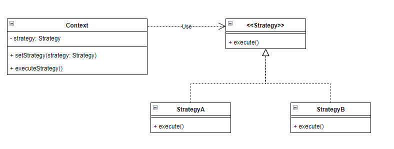

# Design patterns

A design pattern is a re-usable solution to a common problem, this solution is at an abstracted level and thus will require some form of implementation.

## Types of design pattern

In object-oriented programming, there are three main categories of design pattern:

- Creational design patterns: Solutions to instantiating a class, i.e., creating objects

- Structural design patterns: Concerns the structure of code by means of inheritance and composition patterns.

- Behavioural design patterns: About how instances of different classes communicate with other objects

This repository explores some of the common design patterns in use.


### Behavioural

#### Strategy pattern

The strategy pattern is used to enable dynamic behaviour at runtime by allowing the selection of a specific algorithm to be executed:



In the following strategy pattern implementation, we offer two ways of printing a menu using different printing strategies. The `Menu` class is simple, only containing a list of the names of menu items - actual implementations would have associated commands, see the command pattern example for more information...

The strategy interface is simple, defining a single public abstract method which accepts the menu's title as a string and a list of strings representing the menu items:

```java
public interface MenuPrintingStrategy {

	void print(String title, List<String> menuItems);
}
```

Implementations can be created in a variety of ways, the classical form is creating a class which implements the interface:

```java
public class BorderedStrategy implements MenuPrintingStrategy {

	@Override
	public void print(String title, List<String> menuItems) {
		String header = String.format("# %s #%n", title);
		String items = "";
		for (var item : menuItems) {
			items += String.format("| %s |%n", item);
		}
		System.out.print(header);
		System.out.print(items);
	}

}
```

Strategies can also be created on the fly as the `MenuPrintingStrategy` interface follows the SAM rule - the **Single Abstract Method** rule only applies to interfaces, it allows for lambda functions to be specified in place of an actual class implementation. The supplied lambda is expanded by the JVM to an anonymous class:

```java
MenuPrintingStrategy indentedStrategy = (title, menuItems) -> {
	String header = String.format("# %s #%n", title);
	String items = "";
	for (var item : menuItems) {
		items += String.format("\t%s%n", item);
	}
	System.out.print(header);
	System.out.print(items);
};
```

Telling the strategy to do work is as simple as calling its print method and passing it the title and menu items, here is a snippet from the `Menu` class demonstrating this:

```java
public class Menu {

	private String title;
	private List<String> menuItems;
	private MenuPrintingStrategy menuPrintingStrategy;
	
	public Menu(String title, MenuPrintingStrategy menuPrintingStrategy) {
		if (title == null) throw new NullPointerException("title cannot be null");
		if (menuPrintingStrategy == null) throw new NullPointerException("menuPrintingStrategy cannot be null");
		this.title = title;
		this.menuPrintingStrategy = menuPrintingStrategy;
	}

	public void run() {
		Scanner sc = new Scanner(System.in);
		boolean isRunning = false; // usually would be set to true by default, false for the example
		
		do {
			menuPrintingStrategy.print(title, menuItems);
			System.out.print("> ");
			String input = sc.nextLine();
		} while (isRunning);
	}

	public void setMenuPrintingStrategy(MenuPrintingStrategy menuPrintingStrategy) {
		if (menuPrintingStrategy == null) throw new NullPointerException("menuPrintingStrategy cannot be null");
		this.menuPrintingStrategy = menuPrintingStrategy;
	}

}
```

In the `run()` method, we call the printing strategy that was passed into the constructor and stored in an instance field, using its `print()` method.

Use the supplied `Runner.java` file to see an example of this menu being printed, do note that the control flag for the menu loop is set to false in the `Menu.run()` method to enable easy manual testing of both strategies.

##### Exercises

1. Create an additional strategy for printing the menu items which wraps the menu items only in parenthesis.

2. Use this strategy with an instance of the `Menu` class

#### Command pattern

The command pattern is all about encapsulating the required information and behaviour for a request into a stand-alone object, that is we represent a request and the information to perform that request as an instance of a class. Implementations vary, at its simplest there will be a single command execution method of some form but more complex variations also include the ability to undo operations for example.

Here is an example UML class diagram of the command pattern:


Each `Command` implementation will perform some different behaviour, the provided example illustrates a possible implementation of a menu where that menu has `MenuCommand`'s:

```java
public interface MenuCommand {

	public void execute();
}
```

The following example is for printing a value, not very glamorous but illustrates a command:

```java
public class PrintCommand implements MenuCommand {

	private String value;

	public PrintCommand(String value) {
		if (value == null) throw new NullPointerException("Cannot print null values");
		if (value.isEmpty()) throw new IllegalArgumentException("Cannot print empty strings");
		this.value = value;
	}
	
	@Override
	public void execute() {
		System.out.println(value);
	}
	
}
```

The key things to note here is that the state for the command has been passed into the constructor, another option is the command itself in the `execute()` method gathering that data. 

The `Menu` class has an instance field used to store the possible menu commands, this is done using a map (dictionary in Python):

```java
public class Menu {

	private String title;
	private Map<String, MenuCommand> menuItems;
	private MenuPrintingStrategy menuPrintingStrategy;
}
```

This allows for a command to be retrieved from the `menuItems` map and executed, like as follows:

```java
private void executeCommand(String input) {
	for (var key : menuItems.keySet()) {
		if (key.equalsIgnoreCase(input)) {
			menuItems.get(key).execute();
			return;
		}
	}
	// if the method didn't return, there wasn't a matching menu item to execute
	System.out.println("Error: Command does not exist!");
}
```

Using the `Menu` is as simple as passing it key-value pairs representing the menu item names and associated commands:

```java
Menu menu = new Menu("Main Menu", new BorderedStrategy(), Map.of(
		"Hi", new PrintCommand("Hello"),
		"Exit", () -> System.exit(0)
));
menu.run();
```

As can be seen above, we can instantiate an instance of a subclass of `MenuCommand` or we can also just supply a lambda (SAM rule applies here). The downside to using a `Map` is that the order of the menu items is not retained and thus printed in a random order.

##### Exercises

1. Create a new command that prints the 7 times table to the console in the form:

```
1 x 7 = 7
2 x 7 = 14
etc...
```

2. Implement this new command into the menu in the `Runner.java` file

3. Refactor the existing design by replacing the use of a `Map` with a `List` in the `Menu` class, the key part to consider here is that you will need a way to represent a menu items name, its input code and its command. Creating a new class such as a `MenuItem` class would be a good place to start. The only changes for this exercise will be to the `Menu` and `Runner` classes, the `Runner` will have to be changed to instantiate the `Menu` according to your new implementation.

### Creational

#### Builder

#### Factory method pattern

The factory method pattern is used for the creation of objects, this pattern works by providing an interface for creating objects of a superclass, subclasses may alter the type of object created.

> TLDR: We are replacing `new SomeClass()` calls with a *factory method*, i.e., `SomeClassFactory.of()`. The `of` factory method would then be responsible for calling `new SomeClass()` based on inputs we pass to it.

There are many ways of approaching the factory method pattern, commonly either a static method or inheritance based factories are used.

The example used allows players to fight each other using `AttackStrategy` implementations, the interface looks as follows:

```java
public interface AttackStrategy {

	public void attack(Player player);
}
```

The `Player` class holds a field of this interface:

```java
public class Player {

	private String name;
	private int health;
	private int strength;
	private AttackStrategy attackStrategy;
	
	public Player(String name, int health, int strength) {
		super();
		this.name = name;
		this.health = health;
		this.strength = strength;
	}

	public void attack(Player player) {
		System.out.println(name + " is attacking " + player.getName());
		attackStrategy.attack(player);
	}
}
```

The `Player` class does have an `attack` method with the same signature as the interface, but the player itself is not an attack strategy and so does not inherit from the interface. The first implementation is a simple factory method:

```java
public class AttackStrategyFactory {

	// Simple factory method using an attack type enum, it is better to use inheritance as the type returned can be narrowed
	public static AttackStrategy getAttackStrategy(AttackType type) {
		switch (type) {
		case UNARMED_PUNCH:
			return new Punch();
		case UNARMED_KICK:
			return new Kick();
		default:
			throw new IllegalArgumentException("No attack strategies present for the given type");
		}
	}
}
```

Based on a given attack type, the factory method will return a sub-type of `AttackStrategy`. The `AttackType` is an enumerated type with two different kinds of attack, punching and kicking:

```java
public enum AttackType {

	UNARMED_PUNCH, UNARMED_KICK;
}
```

The `Kick` and `Punch` classes are just implementations of the `AttackStrategy` interface:

```java
public class Kick implements AttackStrategy {
	
	@Override
	public void attack(Player player) {
		int damage = 40 - player.getStrength();
		System.out.println("Kicking " + player.getName() + " for " + damage + " points.");
		int newHealth = player.getHealth() - damage;
		player.setHealth(newHealth);
	}

}
```

The `attack()` method here accepts an instance of `Player` which it uses to calculate the damage dealt to them.

##### A more complex, abstract factory

Another implementation has been provided where we use an abstract super-type to get attack strategies, this abstract super-type has factory implementations:

```java
public abstract class AbstractAttackStrategyFactory {

	protected Player attacker;
	
	protected abstract AttackStrategy prepareStrategy();
	
	public AttackStrategy getStrategy(Player attacker) {
		this.attacker = attacker;
		return this.prepareStrategy();
	}
}
```

The `getStrategy()` method is the only public method, this is used by whoever is calling an implementation of this factory class. The `prepareStrategy()` is called by `getStrategy()`, this can be used to generate a custom attack strategy in a subclass:

```java
public class PunchStrategyFactory extends AbstractAttackStrategyFactory {

	
	@Override
	protected AttackStrategy prepareStrategy() {
		if (attacker.getStrength() <= 3) {
			return (defender) -> {
				System.out.println("Throws a meek punch which inflicts barely any damage...");
				int damage = 1;
				defender.setHealth(defender.getHealth() - damage);
				System.out.println("Did " + damage + " damage to the defender.");
			};
		} else {
			return (defender) -> {
				System.out.println("Throws a meek punch which inflicts barely any damage...");
				int damage = 5 + attacker.getStrength() - defender.getStrength();
				defender.setHealth(defender.getHealth() - damage);
				System.out.println("Did " + damage + " damage to the defender.");
			};
		}
	}

}
```

The `PunchStrategyFactory` will return one of two possible `AttackStrategy` implementations, these have been created using lambda expressions but could also have been created as classes as in the previous example.

Examples of using the factory method and abstract factory are in the `Runner.java` file.

##### Exercises

In the `simple` package:

1. Add a new `AttackType` to the enum

2. Add a new `AttackStrategy` for this new `AttackType`

3. Add your new strategy to your factory method in the `AttackStrategyFactory.java` class

4. Test your new `AttackStrategy` implementation out

In the `advanced` package:

1. Create a new `KickStrategyFactory` which inherits from the abstract factory

2. Implement at least two different kick strategies where one of them, based on some boolean expression, will be returned from your factories `prepareStrategy()` method.